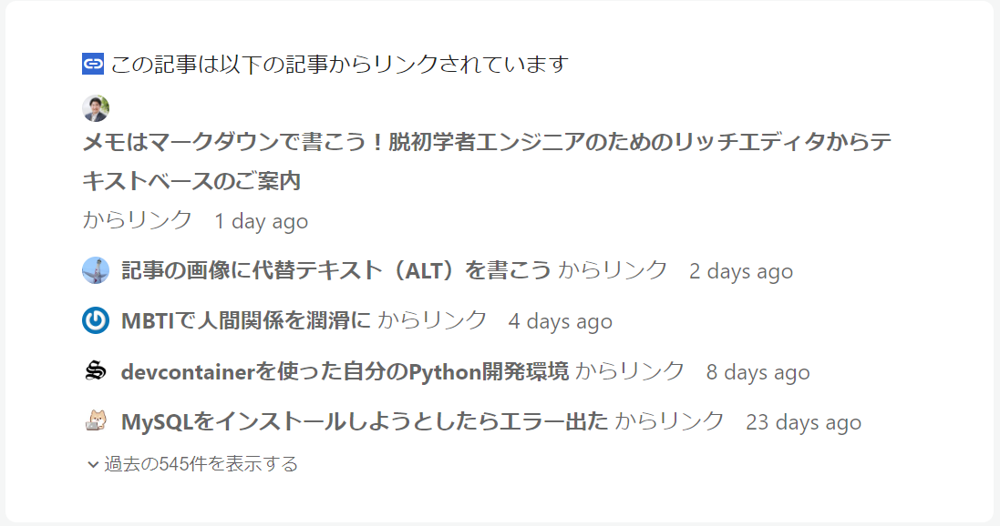

# Astroでもバックリンクしたい!

## はじめに

### Aizu Advent Calendar 2023について

この記事はAizu Advent Calendar 2023の5日目だ。会津大のメンバーが投稿しているので是非みてほしい。

[Aizu Advent Calendar](https://adventar.org/calendars/9379)

### バックリンクとは

バックリンクとは被リンクの一覧のことだ。
あるページにおいて、自身がどのページがらリンクされているかを表示することで、
ページ間の移動を簡単にするという目的で設置されることが多い(あとはSEO的に強いとかなんとか)

記事がデータベースに保存してあるようなプロジェクトで作るのが一般的だと思う。



## 実装

### 概要

バックリンクをこのブログに実装した。Astroの機能を利用しているのでAstro専用である。

各ページでContent Collectionsをすべて解析することで、SSGに対応しつつdev serverにも対応した。

全体としては、markdownの解析を行ないフロントマターに順方向のリンク一覧を書き込むRehypeプラグインと、
astroコンポーネント内ですべてのmarkdownのフロントマターを読み、逆方向のリンクに変換する関数で構成される。

### どうしてそのような設計になったか。あるいは設計の苦悩

今回、このブログに実装する前に、3種類の設計を試した。

- viteのプラグインを作成。Astroのビルドがおわった後に生成されたhtmlを解析し、リンク関係をjsonに書きだす。クライアントでそのjsonをfetch。
- 各ページでmarkdownをレンダリングし、htmlを解析する。

そして採用した、
- rehypeプラグインを作成。markdownのレンダリング時にリンクを一覧し、frontmatterに書き込む。各ページでバックリンクに変換。

それぞれに利点と欠点がある。それぞれを箇条書きする。

- viteのプラグインを作成する方法
  - メリット
    - ビルド後のhtmlを見るので、Content Collectionsに限らない。
      - micro CMSをコンテンツの管理に使うとか、
      MDXでコンポーネントを使うとか。
      - ssgするフレームワークなら、astro以外でも利用できる。
    - 実装が簡単。
    - 依存が少ない。
  - デメリット
    - ssgできない。
    - astroコンポーネントが使えない(致命的)
      - astroコンポーネントはクライアントで利用できないので。

- 各ページでhtmlを解析する方法
  - メリット
    - mdxに対応できる。
  - デメリット
    - 実装がダルい。
      - Content Collectionsをhtmlにする手段が限られすぎている。
      というのも、唯一存在するAPIがコンポーネントのslotに生えているrender関数しかない。
    - astroコンポーネントが使えない(致命的)
      - slotのrender関数を利用する関係で、データの取り回しが面倒すぎる。
    - astro専用

- rehypeプラグインを作成する方法
  - メリット
    - 実装がシンプル。
    - 依存が少ない。
  - デメリット
    - astro専用
    - mdxに対応できない。

最終的に3番目の方法を選択したのはご存知のとおりである。

### 実装のくふう

次のコードはrehypeのプラグインの一部。ここでhastを読み、フロントマターに書き込んでいる。

```ts
    const forlinkNodes: hast.Element[] = [];
    visit(tree, (node, _index, _parent) => {
        if (node.type === 'element' && node.tagName === 'a')
            forlinkNodes.push(node);
    });

    setVfileFrontmatter(file, {
        forlink: forlinkNodes
            .map(node =>
                node.properties == null ?
                    {} :
                    node.properties
            )
            .map(properties => properties.href)
            .filter((link): link is string => typeof link == 'string'),
    });
```

そして`getStaticPaths()`の中でフロントマターを読み、各ページでレンダリングする。
`astro dev`を実行中、content collectionsの更新にあわせてバックリンクを再生成することができる。

```ts
export async function getStaticPaths() {
    const entries = await getCollection("blog");

    const backlinks = await getBacklinks([entries]);

    return entries.map((entry) => ({
        params: { slug: entry.slug },
        props: {
            entry,
            backlink:
                backlinks.get(`/${entry.collection}/${entry.slug}/`) ?? [],
        },
    }));
}
```


## おわりに

### 実装について

Astroに苦しめられた感が強い。

### アドカレについて

アドカレに衝動的に登録したが、ギリギリ間に合った。
もうすこし余裕をもって登録すべき。