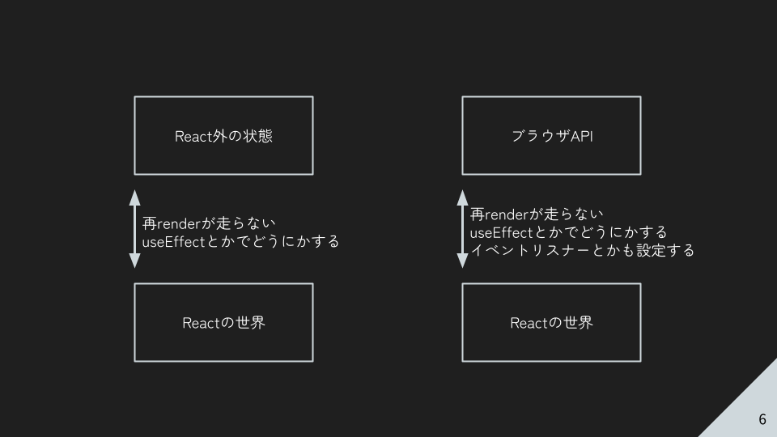

## はじめに

[Aizu Advent Calendar 2024](https://adventar.org/calendars/10858)の6日が埋まってなかったので書いた。

ReactのuseSyncExternalStoreは名前に反して便利に使えるフックなので紹介したい。
ちなみに11月の学内LTと同じネタなので、知っている人は読まなくても良いと思う。

## React外の状態とブラウザAPIは実質同じ

今回のuseSyncExternalStoreでブラウザAPIをラップするという話にも繋がるのだが、Reactから見たReact外の状態とブラウザAPIは同じという話をしたい。



これは学内LTで使ったスライドの一部なのだが、再掲させていただく。

Reactを書いているとき、状態はuseStateやuseReducerなどで扱うことが多い。これらはReactのコンポーネントと紐づき管理されており、Reactが値の更新を把握し、再レンダーを行なうことができる。しかしReactの管理外にある変数などを利用すると、値の更新などが把握できない。

これはブラウザAPIも同様である。ブラウザAPIはReactが管理していないので、値の更新が把握できない。

このようにReact外の状態とブラウザAPIには共通点がある。そして、一般的(主観)にはどちらもuseEffectを使い対応することが多いように思う。しかし、useSyncExternalStoreを利用するとどちらも簡単にラップすることができる。

## そもuseSyncExternalStoreとは

[公式のreact.dev](https://ja.react.dev/reference/react/useSyncExternalStore)には、外部ストアへのサブスクライブを可能にするReactフックと書いてある。そして実は、ブラウザAPIへのサブスクライブという章がある。あまり読まれてない気がするのだが気のせいだろうか？

ともあれ、先ずはuseSyncExternalStoreの型定義は次のようになっている。

```ts
export function useSyncExternalStore<Snapshot>(
    subscribe: (onStoreChange: () => void) => () => void,
    getSnapshot: () => Snapshot,
    getServerSnapShot?: () => Snapshot,
): Snapshot;
```

引数のsubscribeは、値のサブスクライブをする関数だ。値の変更があった再にonStoreChangeを呼び出すことで、ReactはgetSnapshotを実行し、戻り値をuseSyncExternalStoreの戻り値として返す。

subscribeが変更されるとReactは再サブスクライブをするということと、getSnapshotが変更されていないと再レンダーを実行しないという点が少し分かりづらい。subscribe関数はコンポーネント外で定義するか、useCallbackを使用する必要がある。

react.devで紹介されているnavigator.onLineをラップする例は次である。

```ts
export function useOnlineStatus() {
  const isOnline = useSyncExternalStore(subscribe, getSnapshot);
  return isOnline;
}

function getSnapshot() {
  return navigator.onLine;
}

function subscribe(callback) {
  window.addEventListener('online', callback);
  window.addEventListener('offline', callback);
  return () => {
    window.removeEventListener('online', callback);
    window.removeEventListener('offline', callback);
  };
}
```

もちろんuseEffectでも実現可能ではあるが、useSyncExternalStoreを使用する例では直感的に記述できているように思う。

## おわりに

以上useSyncExternalStoreの紹介だった。あまり使う機会は多くないと思うが、おもしろいフックなので試してみてほしい。